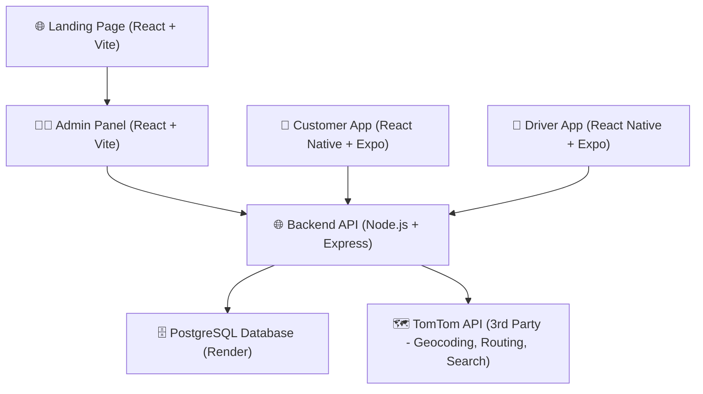
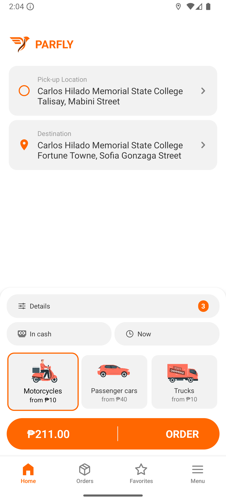
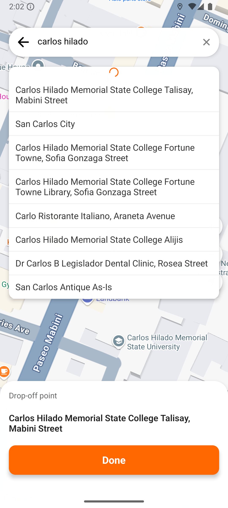
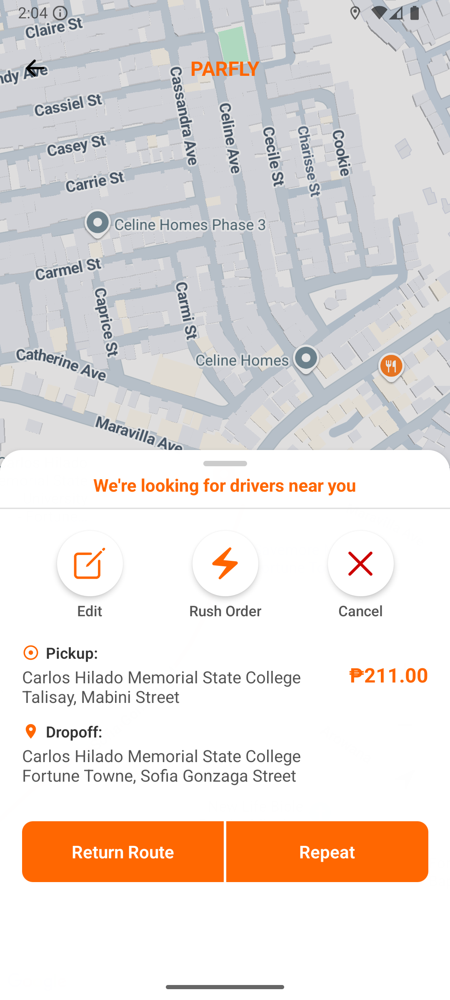
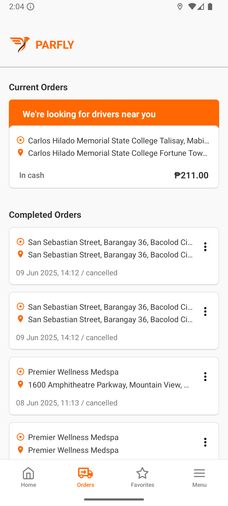
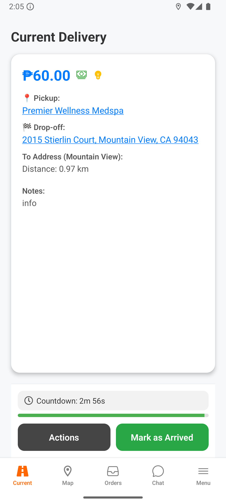
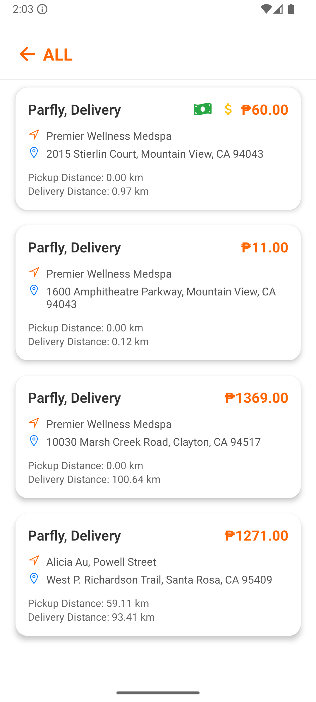
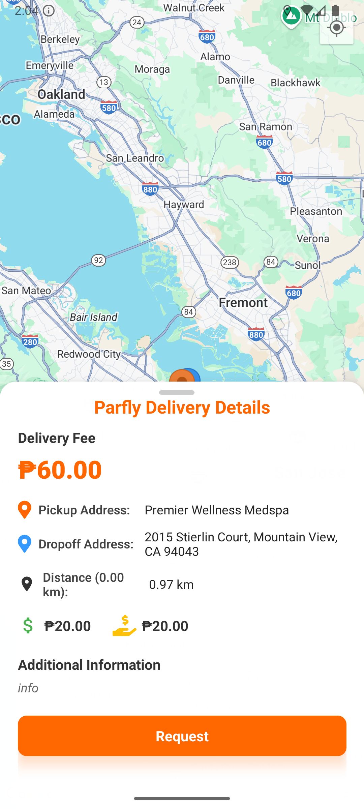
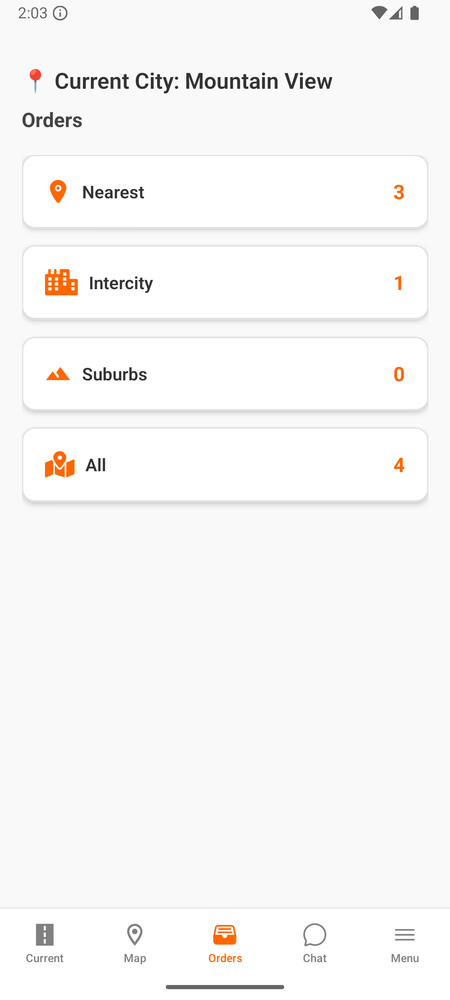

<h1 align="center">🚚 Parfly</h1>
<p align="center">Multi-User Courier Management System with Driver & Customer Apps + Web Admin Panel</p>

<p align="center">
  
  
  
  
  
  
</p>

---

## 🧭 Overview

**Parfly** is a courier delivery platform that connects **customers** with **third-party drivers** for fast, same-day parcel delivery. It features:

- 📱 Customer & Driver mobile apps (React Native + Expo)
- 🖥 Web-based Admin Dashboard
- 🌐 Landing Page
- 🧠 Real-time tracking powered by **TomTom Maps API**

> Inspired by apps like [Lalamove](https://www.lalamove.com/en-ph/) and Maxim.

---
<details open> <summary>
📱 System Architecture
</summary>

**Parfly** follows a **Client-Server Architecture** with multiple client applications communicating with a centralized backend server. The system is designed as a **multi-tier architecture** with clear separation between presentation, business logic, and data layers.

### Architecture Pattern: Client-Server + RESTful API
- **Multiple Clients**: Web applications and mobile apps serve as presentation layer
- **Centralized Server**: Node.js/Express backend handles business logic and API endpoints
- **Database Layer**: PostgreSQL manages persistent data storage
- **External Services**: Third-party APIs for specialized functionality



### Key Architectural Benefits:
- **Scalability**: Multiple clients can connect to the same backend
- **Maintainability**: Clear separation of concerns across layers
- **Flexibility**: Easy to add new client applications or modify existing ones
- **Security**: Centralized authentication and business logic validation
</details>


---

## 👤 Roles & Permissions

| Role         | Permissions & Capabilities                                                                 |
|--------------|---------------------------------------------------------------------------------------------|
| **Customer** | - Request deliveries<br>- Track delivery status<br>- View delivery history                  |
| **Driver**   | - Register via app<br>- Accept deliveries<br>- Update delivery status |
| **Admin**    | - Manage customers and drivers<br>- Monitor all deliveries<br>- Handle reports and operations |

---

## ✨ Features

* 📦 **Same-Day Parcel Booking**
* 📍 **Real-Time Tracking (Drivers & Parcels)**
* 🧾 **Delivery History & Status Updates**
* 🧠 **Admin Dashboard for Full Management**
* 🔐 **Role-Based Authentication & Authorization**
* 🔔 **Delivery Notifications (Status Updates)**
* 🛻 **Third-Party Driver Support (Bring Your Own Vehicle)**
* 🌐 **Public Landing Page for Service Info**

---

## 🚧 Limitations

* 🌍 Delivery limited to local areas (no international shipping yet)
* 💳 Payment support limited to Cash on Delivery and basic online methods
* 🏢 No company-owned vehicles (drivers must use their own)

---

## 🛠️ Tech Stack

<p align="center">
  
</p>


**Frontend:**

- Customer App (React Native + Expo)
- Driver App (React Native + Expo)
- Admin Panel & Landing Page (React + Vite)

**Backend:**

- Node.js + Express.js

**Database:**

- PostgreSQL (Hosted on Render)

**APIs:**

- TomTom API (Reverse Geocoding, Search, Routing)

**Hosting:**

- Netlify (Admin & Landing Page)
- Render (Backend & Database)

---

## 🎯 Objectives

1. Enable real-time tracking of drivers and parcels
2. Implement role-based access (Admin, Driver, Customer)
3. Provide seamless delivery booking and management
4. Use analytics for decision-making (admin reports)
5. Ensure security and authentication for all users

---

## 📷 Screenshots

<details open>
<summary>📱 Customer App Screenshots</summary>

<div align="center">





</div>

</details>

<details open>
<summary>🚚 Driver App Screenshots</summary>

<div align="center">





</div>

</details>

---

## 💡 Future Enhancements

* 🌍 Multi-region & international delivery support
* 🤖 Route optimization using AI
* ⭐ Driver rating and feedback system
* 💳 Additional payment methods (GCash, Stripe, PayPal, etc.)

---

## 🚀 Getting Started

```bash

